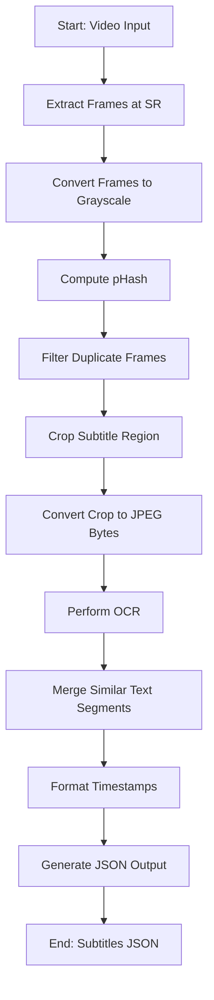

Let's make this folder a sandbox.  
We'll start with this segment: [Facebook Video](https://www.facebook.com/watch/?v=1498555167498694).  
You'll find it in the current folder.

Use segments of videos and tests

Build the logic on the same data

# currend approach

1. **Frame extraction**: video is read frame by frame at a specified sampling rate. Each frame is converted to grayscale.

2. **Duplicate frame filtering**: to avoid redundant processing, frames are compared using perceptual hashing (pHash). Frames with significant differences are retained.

3. **Subtitle region cropping**: bottom portion of each frame, where subtitles appear, is cropped for OCR.

4. **OCR with VLM**: cropped regions are passed through OCR tool or VLM to extract text.

5. **Text segment merging**: consecutive frames with similar text are merged into single subtitle segments based on text similarity.

6. **JSON output**: final subtitle segments, along with their start and end timestamps, are formatted into a JSON structure.

# some ideas not to forget to explore

- adopt a flexible cropping region (it's not always bottom): came acroos [EAST text detector method](https://arxiv.org/abs/1704.03155v2)

- more suitable/optiimized SAMPLE_RATE (instead of just X frames per second): automatically detect frame change in the cropped area intead of naïvely OCR’ing :) the whole frame every time.

- De-duplicate: after OCR find a better way to compare the text string to the previous one. options i think of include:
    - exact match 
    - simple [Levenshtein distance](https://en.wikipedia.org/wiki/Levenshtein_distance)
    - SequenceMatcher threshold (the one i tested)

- automatically calibrate OCR-extracted text using LLM (ex: Gemini, gpt):  somtimes there are interferences such as scene and screen clarity, etc. use llm to further improve the recognition ability of OCR in subtitle extraction (proofread, recognize wrong words or sentences and correct them according to the context to improve the accuracy of the text).

- find a way to get rid of watermarks if prresent (clideo.com for ex.)

- ah yes another thing: at which step should we crop?
    - extract then directly **crop frames** before filtering and do ocr
    - or extract frames, filter duplicates then **crop frames** and do ocr

- maybe explore multiprocessing/multithreading???

- backbones / tools ideas:
    - [doctr](https://github.com/mindee/doctr)
    - llama ocr

- Florence is not that slow (as i thought): we can envisage finetuning it to better OCR french writings

# workflow

Next, we'll analyze this movie: [YouTube Video](https://www.youtube.com/watch?v=8seHrOF_M3M).  
We can't have this one in ur repo as the maximum file size is **25 MB**.
